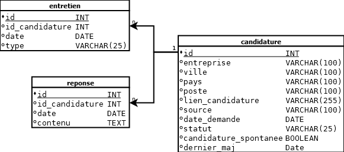

# Suivi de Candidatures

Une application web dévelopée avec Flask et SQLAlchemy permettant de gérer le suivi de candidatures. Elle permet d'ajouter, consulter, modifier et supprimer des candidatures.

## Aperçu de la base de donnée:



## Utilisation:

1. Cloner le dépôt
```
git clone https://github.com/erosboulay/suivi_candidatures.git
cd suivi_candidatures
```

2. Créer un environnement virtuel
```
python -m venv env
venv\Scripts\activate
```

3. Installer les dépendances
```
pip install -r requirements.txt
```

4. Lancer l'application
```
python app.py
```

L'application sera accessible sue localhost:5000